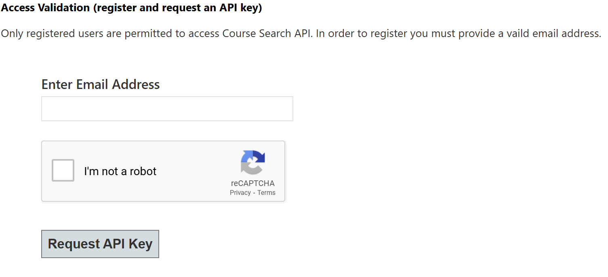

# SIS-Data-Extractor
 Functions to grab and save data from Johns Hopkins University (JHU) SIS Course Search to a text file for ease of access. This is so you don't have to constantly do API calls when developing a program or bug testing, as the API is quite slow.
### Setup
 To use the functions you must get an API key from JHU SIS
 Go to ```https://sis.jhu.edu/api```, scroll to the bottom and request an API Key with your JHU email address.
 
 After you get your API key, put it into a file named ```Key.txt``` in the same directory as ```DataGrabber.py``` or use the ```changeKey("Insert Key Here")``` function and pass in your key as a string into the function. e.g. ```changeKey("kqI1jfnaO")```

### Below is an example of using these functions
 This first line grabs the data from SIS and stores it in the ```fullJson``` variable.
 This variable is essentially a list of dictionaries with the same formatting as SIS outputs.
 ```
 fullJson = getFullJson(schools = "WSE,KSAS",term = "/current")
 ```
 The below lines use that data to selectively write certain selections that are of interest for the specific use case.
 For example, the ```CoursesRequisites.txt``` file may be used for a program that shows all the prerequisites for a specific course.
 ```
 writeData(fullJson, outpath = "CourseData.txt", selections = "all", debug = False)
 writeData(fullJson, outpath = "BasicCourseData.txt", fileformat = "delimed", selections = "Title,OfferingName,SectionName,SchoolName,Term,Instructors,Meetings")
 writeData(fullJson, outpath = "CoursesRequisites.txt", fileformat = "json", selections = "OfferingName,Prerequisites,CoRequisites,Equivalencies,Restrictions")
 ```
 There are two options for fileformat: 
 ```"delimed"``` if you want it to look like a csv, delimited by your chosen delimiters. 
        Default: ```delim1 = ";"``` and ```delim2 = "_"```

 ```"json"``` if you want it to look like a pretty print json
 
 If you want to remove the prints done by default on all functions, use the argument debug = False.
 
 Libraries used: numpy, requests, json
